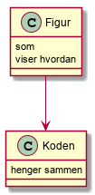

# <Skriv tittel på prosjektet>

<En kort forklaring på hva dette prosjektet inneholder>

## Usage

1. <Hvilken kommando bruker man for å bygge prosjektet>
2. <Hvilken kommando bruker man for å programmet>
3. <Hvordan oppretter man en ny prosjektdeltager?>
4. <VALGFRITT: Hvordan oppretter man en ny prosjektoppgave>
5. <VALGFRITT: Hvordan bruker man http server til å opprette data?> 
 
 ## Design (valgfritt)
 

 ## Implementation notes
 
<Hva gjorde dere godt i implementasjonen>

<Hva følte dere at dere ikke fikk til i implementasjonen>

## Link to review

* link to issue you registered in other group's github repository
